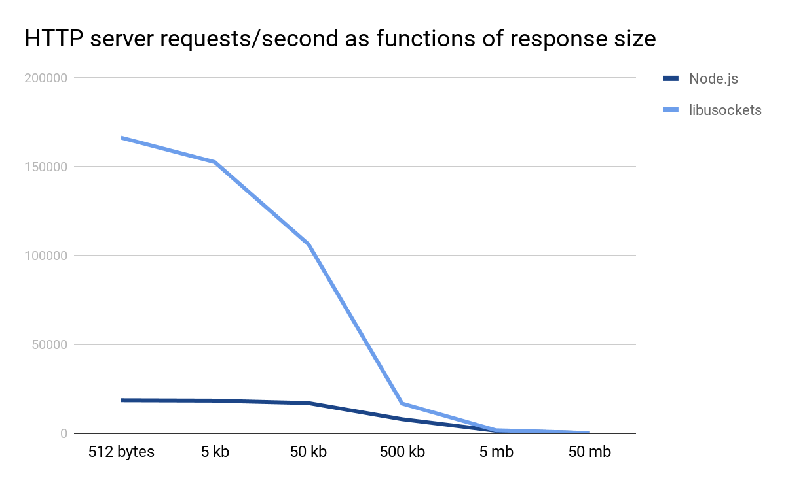
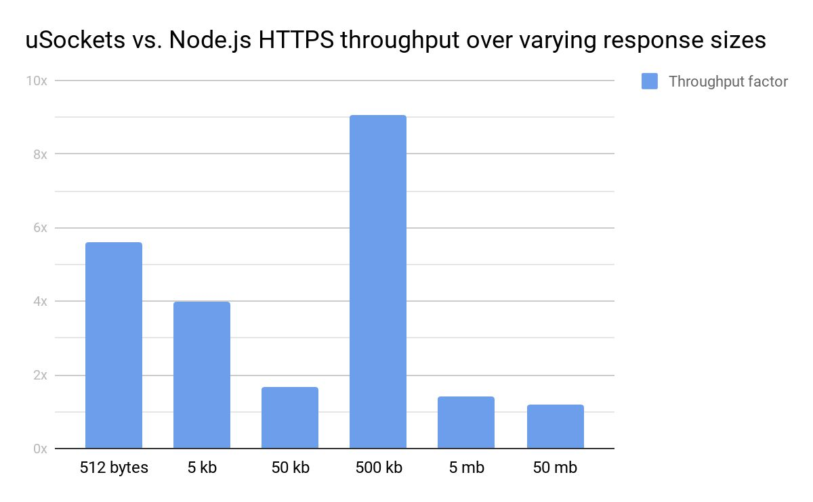

## libusockets

libusockets is a cross-platform async networking and eventing library written in standard C. It is designed to be very careful with memory:

* 4 byte polls compared to libuv's 160+ byte polls and ASIO's 700+ byte polls.
* 40 byte sockets compared to multiple kilobytes of ASIO bloat and libuv misery.

, and time:

Written with multiple backends in mind:

* Epoll
* Kqueue
* Libuv
* ASIO
* Etc..

Under construction still..
