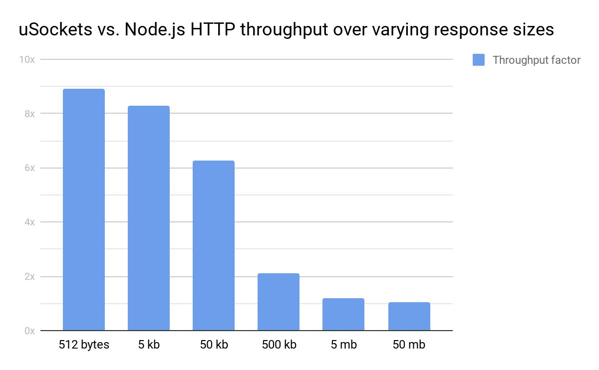

## µSockets

µSockets ("micro sockets") is a cross-platform async networking and eventing library written in standard C. It is designed to be very careful with memory:

* 4 byte polls compared to libuv's 160+ byte polls and ASIO's 700+ byte polls.
* 40 byte sockets compared to multiple kilobytes of ASIO bloat and libuv misery.

, and time:

Non-SSL | SSL
--- | ---
 | 

It reliably beats vanilla Node.js 10 in every possible test case, most significantly at smaller send sizes since larger ones are largely bottlenecked by the Linux kernel rather than the user space server software. REST services or WebSocket servers sending smaller messages are therefore the obvious audience.

### Extensible

The software architecture is based on a hierarchy of purpose-separated plugins. Every layer in the stack builds on the previous layer and is unaware of how it is implemented. Swapping out parts of the eventing layer does not affect the rest of the stack, making it possible to seamlessly integrate with any other event-loop in restricted environments.

The library does not enforce or provide any allocation strategy for backpressure or corking, but leaves this task for the user. It only serves to expose the most fundamental functions needed to quickly get going with networking. Buffers are completely out of scope and should be part of the application.

### What about libuv?
If I could achieve what I'm doing, with libuv, I wouldn't have to write this library. Problem is, libuv has some serious design flaws that makes it completely unusable for efficient servers. Some parts are almost acceptable (uv_poll_t) while others are mindblowingly misdesigned and straight out stupid (uv_tcp_t).

Building something on my own instead of just accepting libuv for all of its flaws was the main reason for µWebSockets becoming what it is today. µSockets is about isolating and documenting these low level parts of µWebSockets as a separate C library for everyone to use, much like libuv but better of course.

Further on libuv has no support for SSL so this leads to servers having to implement SSL as part of their application logic which often leads to poor results and hard-coded dependencies and version-specific hacky code nobody understands (see Node.js).

Despite this, Node.js is Node.js and only exposes eventing via libuv. This is exaclty why µSockets has been designed to integrate with anything - even libuv. This works by letting us_poll become a wrapper for uv_poll_t, while keeping the entire stack above the same so to minimize the penalty it means to use libuv.

### What needs to be done?
Every part of the library is properly split into sections sorted by purpose.

* Every structure is opaque and the main header does not leak any other header.
* OpenSSL integration lies in ssl.c
* WinSock / BSD sockets helpers lies in bsd.h
* Epoll lies in epoll.h and epoll.c

The code is still barely holding together and large changes will happen. Send PRs for parts you find broken or in need of a fix.
