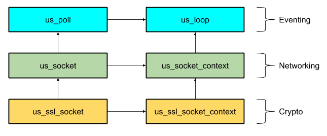

## µSockets - miniscule networking & eventing

This is the cross-platform async networking and eventing foundation library used by [µWebSockets](https://github.com/uNetworking/uWebSockets).

### Key aspects

* Built-in (optionally available) TLS support exposed with identical interface as for TCP.
* Acknowledges and integrates with any event-loop via a layered hierarchical design of plugins.
* Extremely pedantic about user space memory footprint and designed to perform as good as can be.
* Designed from scratch to map well to user space TCP stacks or other experimental platforms.
* Low resolution timer system ideal for performant tracking of networking timeouts.
* Minimal yet truly cross-platform, will not emit a billion different platform specific error codes.
* Fully opaque library, inclusion will not completely pollute your global namespace.

### Extensible

Designed in layers of abstraction where any one layer depends only on the previous one. Write plugins and swap things out with compiler flags as you see fit.

### Compilation
Build example binaries using `make examples`. The static library itself builds with `make`. It is also possible to simply include the `src` folder in your project as it is standard C11. Defining LIBUS_NO_SSL (-DLIBUS_NO_SSL) will disable OpenSSL 1.1+ support/dependency (not needed if building with shipped Makefile). Build with environment variables set as shown below to configure for specific needs.

##### Available plugins
* Build using `WITH_LIBUV=1 make [examples]` to use libuv as event-loop.
* Build using `WITH_GCD=1 make [examples]` to use Grand Central Dispatch/CoreFoundation as event-loop (slower).
* Build using `WITH_OPENSSL=1 make [examples]` to enable and link OpenSSL 1.1+ support.
* Build using `WITH_WOLFSSL=1 make [examples]` to enable and link WolfSSL 2.4.0+ support for embedded use.

The default event-loop is native epoll on Linux, native kqueue on macOS and finally libuv on Windows.
